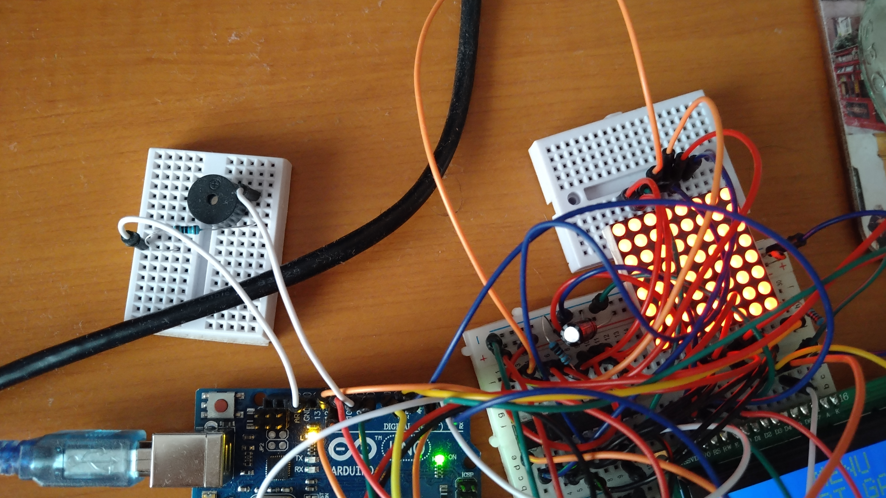
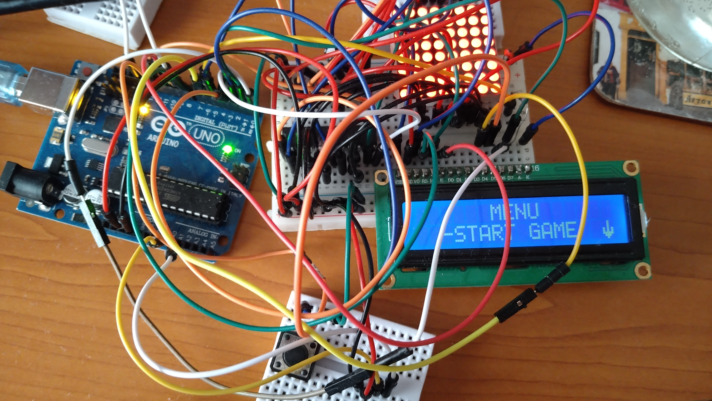
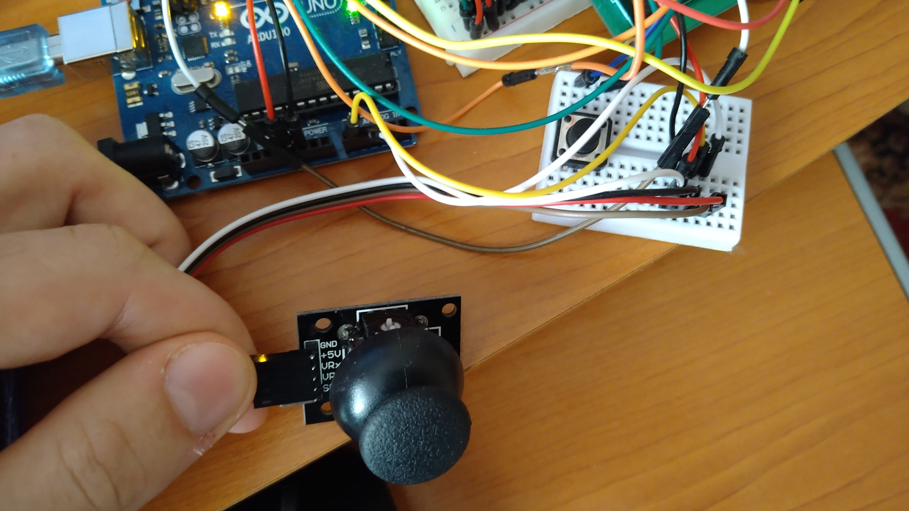

# IntroductionToRoboticsGameProject

### Make a game with an 8x8 LED matrix

Inspired by Ninjump

Components

LED matrix

LCD display

Piezo buzzer

Joystick

Button

MAX7219 display driver

Arduino Uno

Gameplay

You are a dot

You are trying to stay alive as much as possible by avoiding obstacles that come from the top

you can:
- Move to the left side of the line
- Move to the right side of the line
- Jump between lines

Images and video of the setup

Video

About code

## The code has 5 main functions
- processButton();
- processJoystickInput(joystickPos);
- handleScore();
- handleLcd();
- handleLed();

The first 2 handle moving events generated by the user

handleScore(); score exits if the user cannot play,
otherwise it checks for collision, increases the score, and updates the map 

handleLcd(); updates the display based on values modified by the first 2 functions

handleLed(); refreshes the display

## Important variables

int scrollPosition = 0;
- For when the menu is larger then 2 lines
- It holds the current top line

int cursorPosition = 1;
- For when the menu allows to select items to indicate the current item

volatile int gameState = menuState;
- The state in which the game is at the time

## Other important stuff
LcdManager class which holds methods to display all menus

LedMap class which holds all functionality for the game map
(It can be observed that this was the last part added to the code)

### Conclusion
The code got better as i wrote it, but I will not go back to rewrite the other parts

##Inspiration

